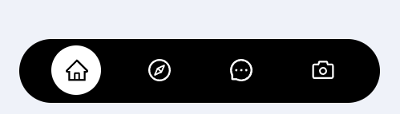
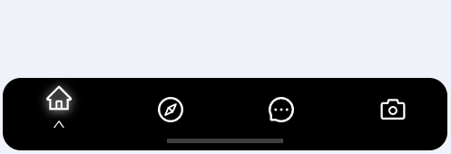

# phone_navigation_components
super simple phone navigation react components 📱
<hr />
<h3>Type A</h3><br />
NavigatorA.jsx<br />
NavigatorA.module.css

```javascript
import NavigatorA from '~/components/NavigatorA';

export default function Home() {
  return (
      <NavigatorA bg={"black"} activeColor={"white"} />
  )
}
```

<hr />

<h3>Type B</h3><br />
NavigatorB.jsx<br />
NavigatorB.module.css

```javascript
import NavigatorB from '~/components/NavigatorB';

export default function Home() {
  return (
      <NavigatorB />
  )
}
```

